# Final Writeup

## hacking into the box
  To be honest, this wasn't my first experience with hackthebox so getting an access code wasn't as difficult as it was the first time around. But in the spirit of the final, I'll try and recall my initial thought process. 

 When first visiting hackthebox.eu/invite you're prompted with a invite code entry and not much else to go off of. 

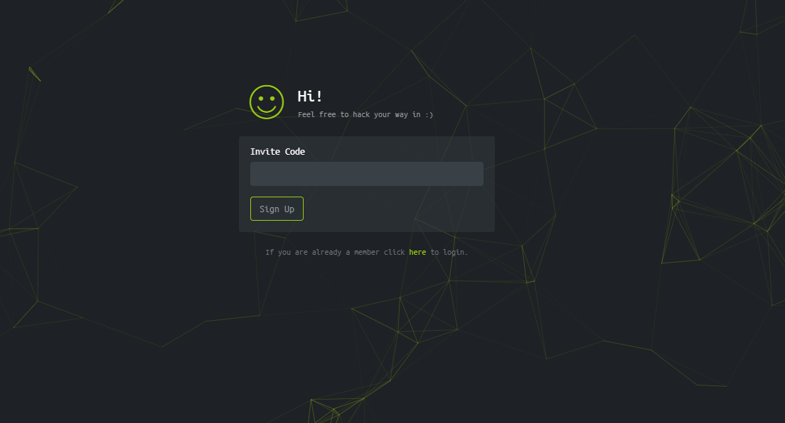

  My first inclination was to click furiously around the page hoping to trigger a invite code generation but that didn't go to well, so I eventually moved to inspect the input form itself. Upon further investigation into the page you can see a minified js file as an import, and what do you know it has a function: `makeInviteCode()` exposed.

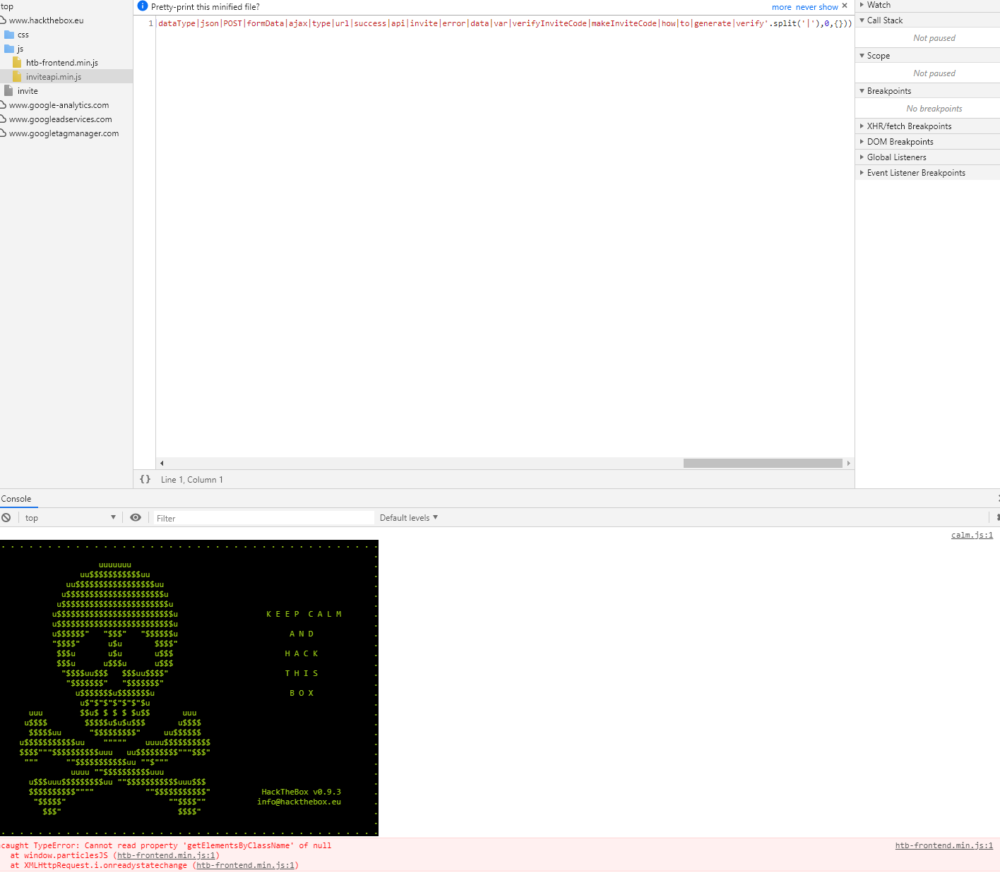

  After calling the inviteCode generator you get a request back from a server containing some base64 encoded text, once decoded the text says to send a post request to api/invite/generate. After sending a curl* request I got back my invitation code Woohoo!

* initially I had used a web-based http request generator and I ran into a IP specific error that blocked me for quite some time.

# Challenges 

  Despite my previous experience getting an access code, I've never really done any challenges, labs, or really anything on HTB due to lack of knowledge/experience. So as a result, most of my completed challenges were ranking easy-medium and for a quick reference of what challenges I've completed I'll keep an up-to-date "completion tracker" screenshot following this paragraph.

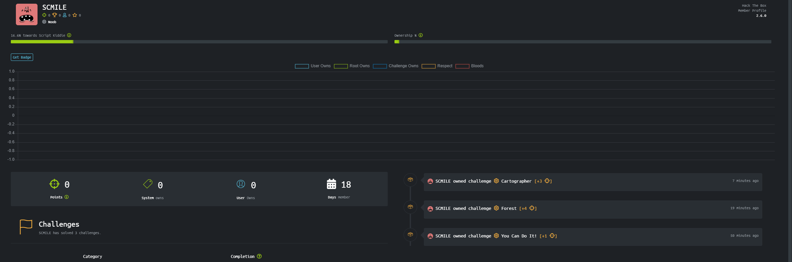

## you_can_do_it!.txt -Crypto Challenge 10 pts

  With free reign to do any challenges on HTB and little to no experience with it, I felt inclined to find the easiest challenge possible to get a feel for things. You Can Do It is an under the crypto subsection when it's opened, is just a .txt file containing the characters `YHAOANUTDSYOEOIEUTTC!` and that's it. 

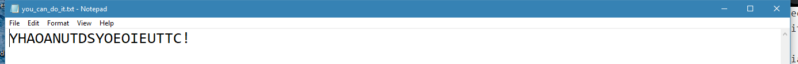

  I initially thought it was going to be a piece of cake so I busted out a pen and paper and went to work trying to decode it. After about 15 -20 minutes and countless orientations of the characters above, I gave up on the manual approach and decided to look for a tool to help me online. Both in our classes clack channel and all over the HTB forums https://www.dcode.fr is considered THE one stop shop for all things cryptographic. Once I got to the website I knew I wanted the cryptography section -> transposition cipher but I didn't know which one to pick after that. Eventually, I stumbled on the caeser-box cipher with an option of brute-force, perfect. 

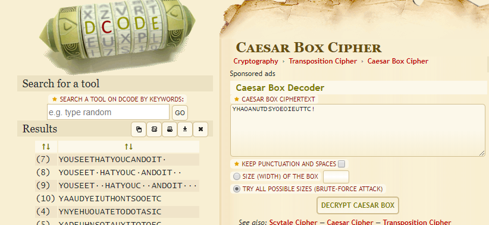

  With the decrypted message in hand I went back to hackthebox only to not read the instructions for 5 minutes and wonder why it wouldn't take my answer. Originally I was trying to submit my answer as `YOUSEETHATYOUCANDOIT`, but as I know now, it requires an htb wrapper  for your submission like so: `htb{YOUSEETHATYOUCANDOIT}` 

**you_can_do_it! -Proof**
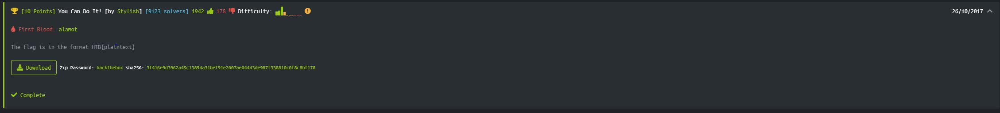

## forest.jpg -Steganography Challenge 40 pts

  With my first challenge out of the way I wanted to pick something foreign and weird so that I could learn even more from this class; So I picked medium-ish challenge from the stego category. When downloaded and unzipped it, I was presented with a picture of a forest and nothing else. 

  I know that Steganography is the encoding of messages in songs, images ,videos etc so my first instrinct was to try and see if I can find anything hidden amongst the trees. Lo and behold, there are some very hard to read characters hidden in the upper left of the image. Then I used windows default photo manipulation to make the hidden text more readable, resulting in the monstrosity below :

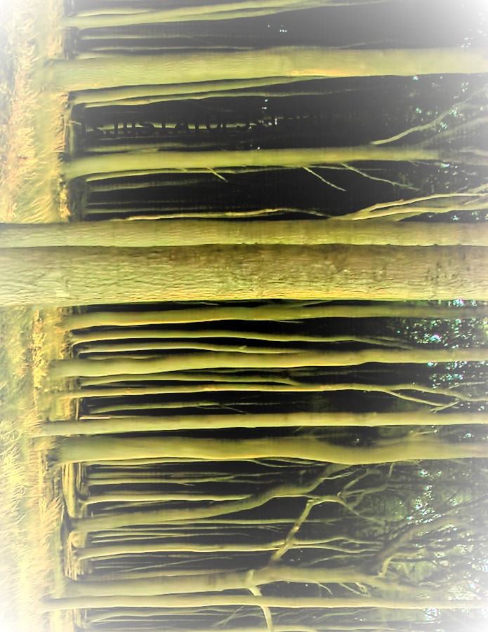

- `IsJuS1Af0r3TbR0`

  This is where I was stuck for a very, very, long time. I tried submitting it as a a code, didnt work; I tried using online analysis on the forest image with that as a password, didn't work; Eventually I fell back to the forums where people were suggesting using a CLI by the name of steghide. After running steghide on the file you get the following message:

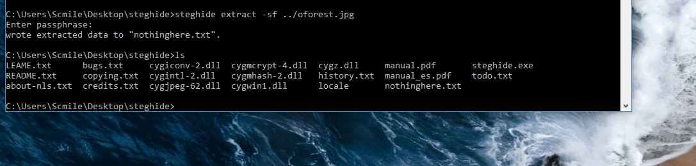

- nothinghere.txt

Upon opening the contents of nothing here, I was presented with a very long and encrypted paragraph with a very interesting ending to it:

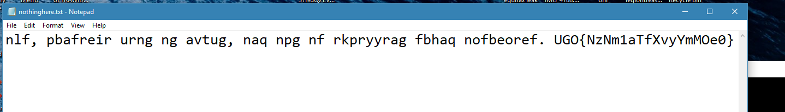

  The ending looks alot like the answer-code format, so I took the contents back to my trusted caeser decrypter and got a very informative pargraph about the forest as an ecosystem and the answer-code: `HTB{AmAz1nGsKilLzZBr0}`, yay!

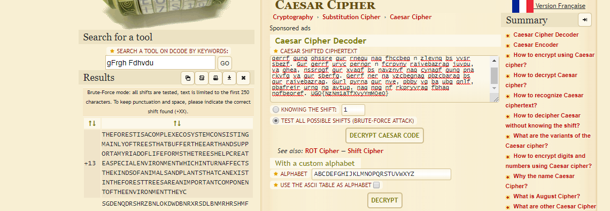

**forest.jpg -Proof**
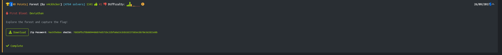

## Cartographer -WebPenetration Challenge 30 pts

  With my final required challenge I really wanted to exercise some of the web-based skills we learned in the last couple weeks of labs and lectures. Cartographer was unlike the other two in that instead of having to download files and alter them, HTB gives you the ability to spool up a vulnerable web-page inside a docker-container hosting this challenge.

  Upon landing at the containers address I was greeted with a fairly plain and simple web-page with a login form on it, and sadly it wasn't a copy of the invite-code challenge where I could just call some javascript function from the console. This page had 0 javascript files on it, in fact the only files pulled down from the container were a css file and an html file for the form:

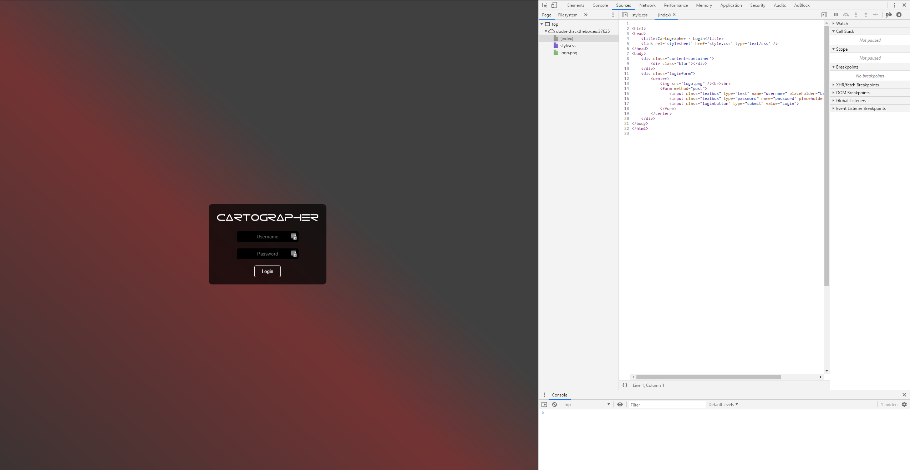

  With week7 still fresh in my mind I turned to trying to escape some SQL in the input fields, and I had no luck. I eventually fell back to the forums once more to see that some people use a tool called sqlmap( which is an automated sql-injector) so I downloaded that and tried it against my docker container and got the following output letting me know that the username was vulnerable.
  

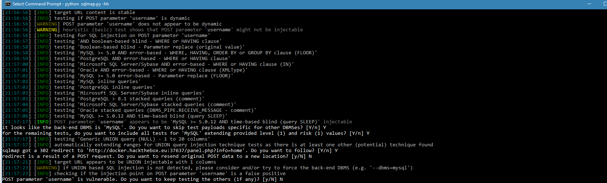

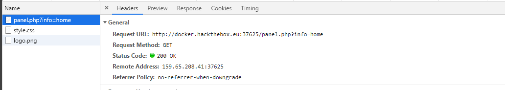

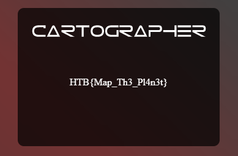

**Cartographer -Proof**
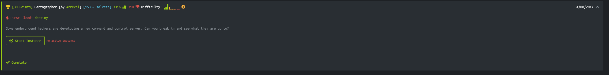

