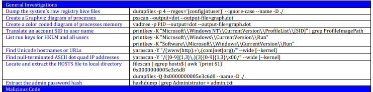
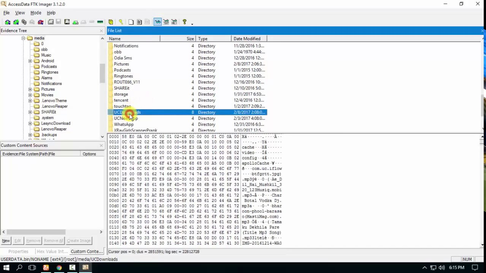

# Week 2- Advanced Foresics

## Ideas

This week was centered around forensics, reverse engineering and common practices of a forensic investigator.
There are many reasons to hire/need a forensic investigator but the following 5 reasons are most common:
- Unauthorized data access(hackers)
- Fraudulent activity
- IP theft
- Human Exploitation
- Inappropirate use of internet(NSFW activites at work)

#### Types of Forensics:
- **Live**: The suspects device is currently on whether at the scene of the crime or cryogenically frozen and brought to a lab. This device still has all of its RAM untouched (mostly) and can have a memory dump performed on it to get all volatile data off of it. This is usually best case scenario as memory dumps contain a lot of useful information like the master file table, secrets etc. 
- **Post-mortem**: This is the less ideal situation but still can be very fruitful if you know what you're doing. This is an investigation into the main storage component of the suspects device, but in some cases can be an investigation into perihperal devices as well(as long as they're non-volatile). Given todays growing storage sizes (1TB +), there is an increasing amount of data to process in the same time-span as 10 + years ago. This has lead investigators to exploiting hashing to quickly compare contents of files against known exploitive content/IP. 
- **Network Based**: This is often a pre-cursor to a live or post-mortem investigation and can be performed without direct access to the suspects computer. It montiors activity through firewalls, routers, ISP datalogs etc.

#### Incident Response Procedures:
The main workflow of an investigation follows these three steps- evidence aquisition -> investigation and analyses -> reporting. But it's not as simple as it may seem, because not only do you have to translate a complex topic into something a layman can understand, but at the same time you must not ruin the investigation by mistake. 
The following steps should be taken when during your investigation to help preserve the evidences integrity:
- record the current system time to get a baseline to work off of for all other devices & times that might be used
- take a cryptographic hash of the system right away to get a baseline signature to always refer back to.
- make a copy of the original
- hash the copy to make sure the two match.
- if you do end up contaminating the system, make sure to document it.

#### RFC- 3227 && Evidence Collection
Expanding on the procedures element above is the volatility grade of the information, and the order of which it should be collected. This order is from RFC-3227 which is a guideline for evidence collection:
`system memory -> temp files -> process table -> routing information -> disc aquisition -> remote logging data -> physical configurations -> backups`

The first four steps of evidence collection should/ can only be done during a live-investigation, while the other 4 steps can be done post mortem. 

#### Tools
- **Yara**- a Regex matcher on steroids. It is primarily used for the identification and classification of malware samples using rules created by a forensic investigator.Below is an image showing what is displayed when Yara finds a file that matches a rule set / signature.

- **Volatility**- a program that analyses memory dumps from a program like FTK imager. There are a bunch of commands to get more specific with the types of information you're looking for as well. Below is a cheat sheet sample of those commands.

- **FTK Imager**- a program with a nice GUI for the creation of disk images and memory dumps for programs like Volatility to use and analyse. It also allows the export of master file tables which is not classically allowed, especially in a windows environment. Below is an image showing off FTK's awesome GUI.

Similar to last week where there was a dyanamic duo of technology, there's a dynamic trio this week: Yara, Volatility and FTK. Where you could get the memory dump using FTK, analyse it using Volatility then do pattern matching checking against it using Yara to quickly identify and known suspicious behavior. 

## Fun Facts Learned
- Mac times stand for modified at, accessed at, and created at.
- Hashing of images to prevent emotional burnout in human trafficking cases, and speeds up massive analyses of forensic cases. 
- A lot of passwords/secrets are stored in memory and can be viewed inside of a memory dump.
- **Locards Exchange Principle**: you can't interact with a live system without having an effect on it/ leaving your digital fingerprints all over it.
