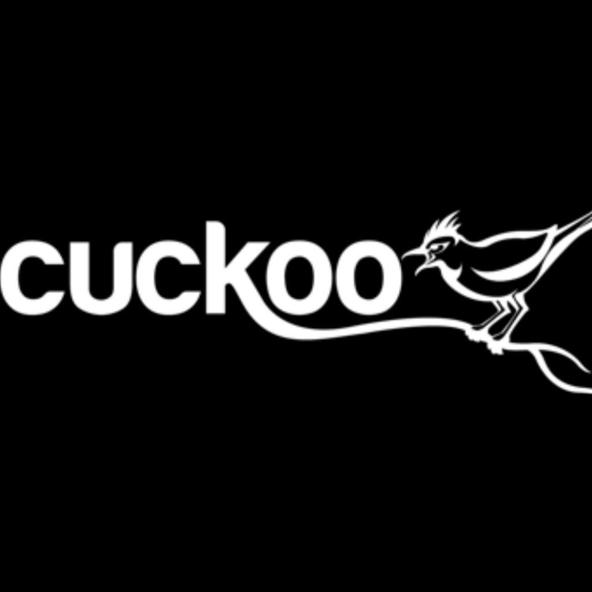

# Week 3- Malware Defense

## Ideas

This week was centered around Malware, Attack vectors for infection and how to defend against those vectors. We got to use Yara more in depth and were introduced to a new tool Cuckoo in the labs this week. For both defense and attack vectors, they can be broken down into four main events:
 - First Contact
 - Local Execution
 - Establish Presence/Persistence
 - Malicious Activity/ Establish 

#### Attack Vectors:
 - **First Contact**- This is where the rubber meets the road so to speak, it's where a user is first exposed to Malware. This can be done a variety of ways from instant messaging to a watering hole poisoning. My favorite one discussed was physical access as it is usually the most overlooked of all the ways you can get infected, and popular cases like Stuxnet have shown the importance of it.
 - **Local Execution**- This is what I think would be the hardest part about making Malware. It's getting the user to run the stuff in the first place. The main two means of doing this are through exploitation of existing systems like Windows autron feature, and social engineering. 
 - **Establish Presence/Persistence**- Once the malware has infected your computer, the author of the code has two choices pretty much on what to do in terms of keeping the user non the wiser. The first is to blend in, now this can be done many ways but the most common is to use filenames that are similar to system files and change their mac times to blend in. The second is to hide in the form of a bootkit or a rootkit and just run at startup behind the OS.
 - **Malicious Activity**- 

#### Defense Against Previous Vectors:
 - **First Contact**- 
 - **Local Execution**- 
 - **Establish Presence/Persistence**-
 - **Malicious Activity**- 

#### Anti-Malware Characteristics
Expanding on the procedures element above is the volatility grade of the information, and the order of which it should be collected. This order is from RFC-3227 which is a guideline for evidence collection:
`system memory -> temp files -> process table -> routing information -> disc aquisition -> remote logging data -> physical configurations -> backups`

The first four steps of evidence collection should/ can only be done during a live-investigation, while the other 4 steps can be done post mortem. 

#### Tools

- **Cuckoo**- is an open source automated malware analyses tool that oulines file behavior and charateristics. It executes files in a realistic environment/sandbox and records everything that happens including API calls and network traffic. 

- **Yara**- a Regex matcher on steroids. It is primarily used for the identification and classification of malware samples using rules created by a forensic investigator.Below is an image showing what is displayed when Yara finds a file that matches a rule set / signature.

Cuckoo was definitely the star of the show this week in my opinion, so much so that I went out of my way to play with it a little bit more on my own free time. It integrates perfectly with both Yara and Volatility, which makes things like memory analyses a breeze. And in a similar fashion to Linux, it's super modular and a bit like Lego, you can make your own custom analyses sandbox with parts available on github/sourceforge etc.

## Fun Facts Learned
- Yara can take fairly complex logic and use things called wildcards to get around random byte/string fillers.
- Most of the time when developing Anti-Malware systems you have to be looking for patterns across malware, because by the time you finish writing a tool for current malicious software, there's already 5 more programs to take its place. So you need to be able to anticipate what the bad actors are going to create next.
- Windows autorun/startup program runner is absolutely massive and is a great hiding place to put some maleware to keep it persistent. 
