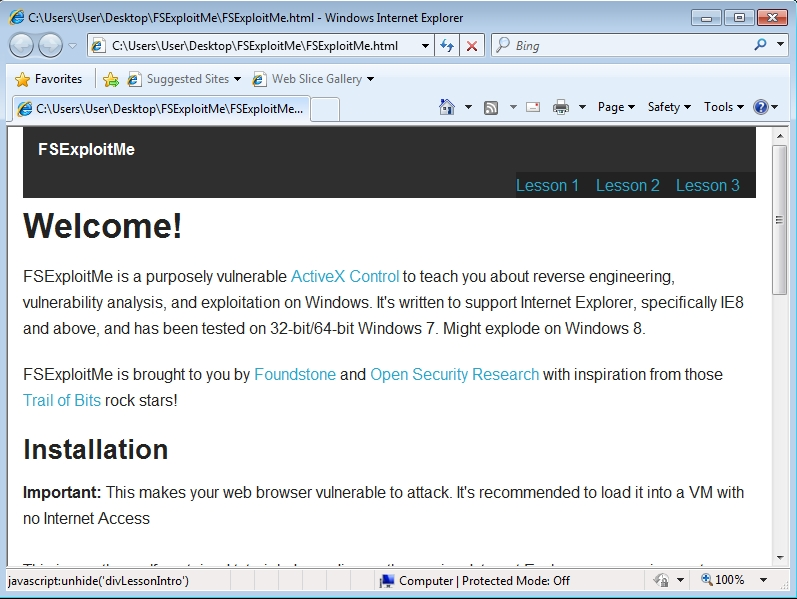
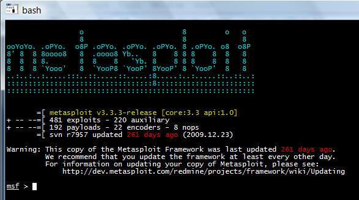

# Week 4- Software Vulnerabilities & Common Exploits

## Ideas

This week focuses on the topic of Software Vulnerabilities and common exploits on  modern computers, this is almost the exact opposite of last weeks defense strategies. The specific exploits covered are for windows systems(on IE), although there are similar exploits for other operating systems. Our speaker Brad Antoniewicz works as a White hat hacker at Mcafee and really helped dispel a lot of the myths I had let myself believe about hacking. 

### Primary Hacking Paths:
 - **Software Vulnerability**- This is where both of our Labs this week live. It's exploiting a programmers logic for your own good and it can happen in a variety of ways from not sanitizing your inputs from a client to something more complex like memory corruption. Either way this is caused by human error and lack of consideration for exploitation. 
 
 - **Exploiting Misconfigurations**- Hacks under this category often occur because honestly life is usually a lot easier with relaxed security protocols. Things like 2 factor authentication, firewalls, encryption at rest, etc. all cause your life to move slower and from a business perspective that means less money. So more often than not you have folks skipping this type of stuff in favor of nothing, or they just simply don't configure it right so the benefit is lost anyways. 

#### General Process

There's a general and fairly simple two step process for a hacker to have successfully "hacked" your device. The first is simple, it's to trigger a vulnerability which could be overflowing a buffer, tampering with uniitialized memory, abusing faulty authentication, etc. Once the hacker has triggered the vulnerability and the process is in a state of freefall and or panic, the goal of the hacker is to try and control that freefall and introduce a payload(shell code primarily) at the same time.

#### Memory Corruption:
This was the over-arching focus of the exploits shown to us by Mr. Antoniewicz. Memory corruption deals with the exploitation and maniplation of system RAM to a hackers benefit and this week we got hands on experience with the methods known as buffer overflow/stack overflow and use-after-free heap manipulation. 

 **Buffer/Stack Overflow**- This method exploits the stack and its properties when an overflown value is written to it. If a user submits a string to a program that takes a buffer but that program doesn't check the size of the passed in string, you'll get what's called buffer overflow. And since that string is usually a parameter to a function, it's on the stack and starts over-flowing to other members of the stack namely the EIP (which houses the address of the next instruction to execute). Using this a hacker can determine the postition of the EIP register using a non-repeating string and then redirect the EIP to some shell code of their choosing, and finally find an instruction in the program that contains a ffe4 code, splice the address to being with ffe4 then the system will run the instruction during freefall. 

 **Use After Free**-  This method focuses on using the heap instead of the stack like the stack overflow exploit. It's also much simpler in terms of trying to understand the steps since there's only 4 :
- free the object.
- replace the object.
- position the shell code.
- re-use the new object with the shell-code embedded. 

 The processes for replacing/positioning and reusing are extremely similar to the processes we used when exploiting a stack overflow, and tools like WinDBG are extremely helpful in finding the right memory addresses.

#### Tools

- **WinDBG/WinBAG**- Windows debugger is software developed by microsoft for the debugging of programs on their platform. It's main features include the ability to halt programs and take register dumps, providing assembly code for program instructions, allowing users to place breakpoints at instruction addresses and even look at modules being loaded into the program on start. The only downside to the program is the horrendous UI, but what can I say, it's from Microsoft.

- **FS exploit me**- this is a opensource website running a vulnerable instance of ActiveX Control, and is a learning aid for exploiting Windows primarily in the web browser environment. This was the primary focus of our labs and was created by Brad Antoniewicz himself.

- **Metasploit**- Metasploit is a truly massive open-source project developed primarily by Rapid-7 to share common exploits, hacking vectors, IDS signatures and so much more. I had a network security class before this one where we'd run an instance of Metasploitable in Kali-linux and just go to town on it.

WinDBG is the obvious winner in terms of tools this week -regardless of my love for Metasploit- it's proved to be almost too useful in the labs to not be given the recognition it deserves. The ability to spill a programs guts outs, sift through them quickly, translate between hex and decimals in 2 words of code, it's simply awesome. 

## Fun Facts Learned
- Most major vulnerabilities in today's world are triggered by Javascript and as a result is primarily performed through a web-browser.
- The vulnerability/exploits of today are vastly different(yet strikingly similar) from those years ago. Where in the past perimeter attacks were more common, nowadays companies have their perimeters guarded quite strongly, so bad actors are forced to resort to a honey-pot type strategy.
- EAX register in windows operating systems hold the return values of a function call. 
