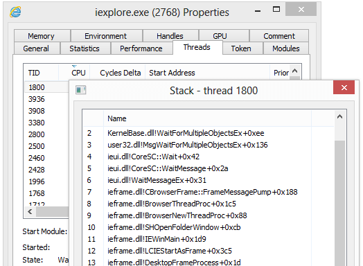
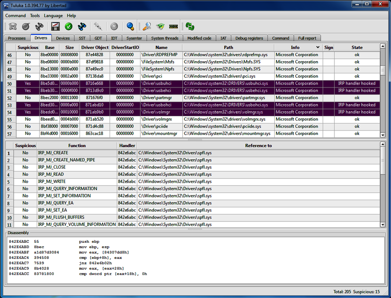
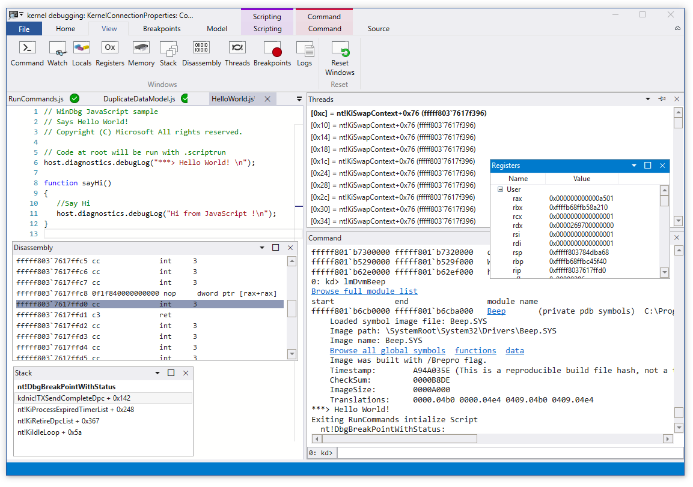

# Week 5- Windows Interals & Kernal Debugging

## Ideas

This week focused on the inner working of windows from boot processes to 32 bit virtual memory layout. When discussing this topic, it's almost impossible not to bring up rootkits and bootkits, so that's what our guest speaker Aditya Kapoor did. Additonally there was a lot of review regarding Kernal/User memory, process scheduling and Hooking that will be covered briefly. 

#### Review:
- **Processes/Threads**- a process is a running piece of software, and a thread is the smallest piece of execution for a process. Threads from the same parent process all share the same virtual address parents, but processes do not. Processes are shceduled to run by the cpu through a variety of different methods from round-robin scheduling to lottery-scheduling.
- **User/Kernel Memory**- User memory is available to processes running in user space, and in turn is very restricted in what it can do in terms of execution, reading other memory etc. On the other hand is kernel memory has access to all of the devices memory and hardware, making it quite a big deal if it's every compromised.
- **Hooking**- is at its very core, just intercepting or "hooking" into function calls, module loading,sys-calls, hardware events(keystrokes, mouse movements) etc.

### Malicious Kits:
**RootKits**- Rootkits are pieces of malware that have the over-arching goal of conealing themselves from the users and system of the device, while also having root permissions in a system. They are most commonly found on Windows-32 Bit devices due to complications when trying to infect 64 bit systems. A rootkit infects usually through one of these three ways :
- exploits in the kernel.
- bypassing or stealing valid driver signature checks.
- adding itself to the bootpath.
 
**BootKits**- Bootkits are nearly identical in terms of functionality when compared to a rootkit, but their main difference is the fact that they add themselves to the master boot record so it can survive reboots. Once a device is infected with a bootkit it can be incredibly difficult to remove, since a bootkit has access to the kernel and boot process.

#### Rootkit Types
- **User-mode rootkit**: The easiest to detect of all the rootkits, but still menacing. A usermode rootkit has admin privileges granting it the ability to hide processes, files, ports etc. But since it does not have kernel access it is much more likely to be detected by a hypervisor layer of security.
- **Kernel-mode rootkit**: Kernel mode rootkits are exactly like their user mode counterparts, except they have access to the kernel and int turn are far more difficult to detect. 
- **Hybrid rootkit**: A hybrid rootkit, is simply a blend between a kernel rootkit and a user rootkit and is the most common type of rootkit for malicious activity.
- **Firmware rootkit**: As with the other three, the name really gives away what the rootkit does/ where it lives. A firmware rootkit plants itself inside of firmware, so that on system restart it will always be there. And like the kernel mode rootkit, its very difficult to detect unless using secure boot.

#### Tools

- **Process Hacker**- this is a opensource tool thats incredibly similar to the windows process manager but with a few really cool extras. The main "extra" is that it lays out process virtual memory starting at 0x0h, the layout includes details like whether that page is R, RW, RX etc, and can help you identify foreign malicious code trying to hide in a process via process injection.

- **Tuluka**- this is an anti rootkit tool that proved to be useful in our labs for identifying whether or not we had successfully removed the malicious file reference. 

- **WinDBG/WinBAG**- Windows debugger is software developed by microsoft for the debugging of programs on their platform. It's main features include the ability to halt programs and take register dumps, providing assembly code for program instructions, allowing users to place breakpoints at instruction addresses and even look at modules being loaded into the program on start. The only downside to the program is the horrendous UI, but what can I say, it's from Microsoft.

Although WinDBG was incredibly useful in the labs this week, Process Hacker was even more so. The ability to step inside of a processes virtual memory and see all of the addresses, permissions etc. proved to be invaluable. 

## Fun Facts Learned
- Windows virtual memory on 32 bit systems is 4GB.
- HackerDefender is the father of all modern day user-mode rootkits because it's the first one.
- 10% of all current malware use rootkits 
