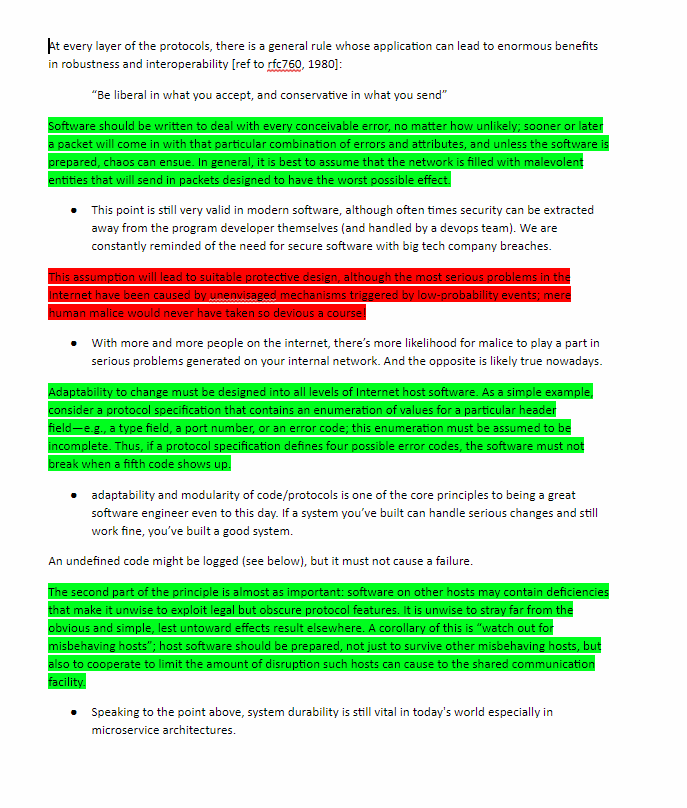

# Week 6- Network Security

## Ideas

This week we had the pleasure of having two guest speakers from Intel to talk to us about internet security, their names were Ram Venugopalan and Geoffry Cooper. A lot was covered this week from principles to types of threats and protection strategies to defend against them. First we'll discuss the attacks then how to defend against them, and then go over a firewall policy example.

### Threats:
Threats on the internet are everywhere, but we can split them into two main catagories. The first are threats that are on the internet, these threats include worms, botnets, resource theft and recon/espionage. The second catagory is threats that are from the internet, and this includes things like DDOS attacks, MitM attacks, Morris worms, Stack Overflow etc. Given the sheer magnitude of threats on/from the internet I'll be going my two favorite from each sector.

**DDOS**- traditionally known as a DOS(denial of service) attack, in modern network security a DOS attack is easy to trace and shutdown. So in order to make it a lot more difficult to trace and block, attackers came up with a Distributed Denial of Service attack that comes from many source hosts. This makes it difficult to find out who's real or not. DOS attacks are mainly focused on resource consumption resulting in loss of service to the destination host. A Few type of dos attacks are:
- cpu
- memory
- storage
- application vulnerabilities(resulting in a crash)
- socket flooding
- connection pool flooding

**MitM**- MitM or man in the middle attacks are attacks that intercept internet traffic and do one or more of these three activities:
- scrape : an attacker takes all of the information out of a message and uses it for other purposes. Ex: MitM scrapes your user name and password from a login.
- re-route : an attacker sends your information to a completely different host, possibly resulting in you recieving a connection with a host you did not want to have.
- alter : an attacker alters the information you have send to your destination host, as a result instead of buying one pizza you just bought 30000.

**Arp Cache Poisoning**- usually used in a local network setting, and often in conjunction with a MitM attack, an arp cache poisoning essentially tells your computer that the attackers host is the internet gateway and you end up forwarding all of your traffic to the attacker instead of the router. This allows the attacker to do what they please with the data. 

**Recon**- Recon can be broken into two categories, active and passive. The names give away what each does really, for active you are actively trying to find either a vulnerability to exploit or finding addresses of services to attack. Whereas with passive recon you are learning about the network by scanning ports and sifting data. 

### Defenses:
Defenses for network security come in all shapes and sizes and require varying amounts of configuration. This configuration requirement is often the greatest barrier for a company to use a piece of software. 

**Whitelisting/ Positive Policies**- A whitelist is a list of activities and actions you expect a system to produce. This gives the defender a massive advantage because you can be incredibly granular with the traffic you let through a policy, which as a result limits the attack surface available to an attacker. A positive policy is usually implemented in one of these three systems:
- firewalls
- internet/web gateways
- email gateways
The only real downside to a whitelist is that it might detect bad actors but it cannot identify them.
 
**HoneyNets**- HoneyNets are very similar to the popularized term of honey-pots. They are bait that's left out for an attacker to fall into and be trapped.The system can often use delayed response times and a maze-like network structure to try and absorb as much of the attackers time as possible. During this wasted time, other systems and sys-admins can evaluate the threat and act accordingly. Unfortunately, this system is very config-heavy and as a result, not many companies implement honeynets. 

**IPS/IDS**: Intrusion prevention/detection systems are a lot like anti-virus systems in terms of evaluating threats because they use signature matching and hashes. IPS's are incredibly fast and provide information about an attack unlike a firewall. The only downside is that they can not help with zero-day attacks and that they can provide false positives. 

**Quarantine**: Quarantines are remarkably similar to honeypots, except they are even more restrictive in the activities of a host. Quarantines are exceptionally useful for analyzing behavior and analyzing traffic before letting it in to your internal network. A quaratine can cause issues on a network if a good actor gets blacklisted , causing them to retry through various methods resulting in a lockout on many entry-points. 

**Reputation**: Last, but not least is the reputation approach. Much like it sounds, reputation is basically assigning behaviors to things like files, urls, and ip addresses. Reputation systems work best when combined with Big Data, because trends begin to appear in regards to malicious IP's when you analyze threats at scale. Things like zero-day exploits and stale data can still thwart reputation systems though, so additional systems are likely required.

## Robustness Analysis
This is my take on the Robustness Principle and how it manages to keep up with modern day practices and teachings.

## FireWall policy document
This is an example firewall policy document.

## Fun Facts Learned
- Companies serve out/ compute reputation for various actors, IE: files, IP's, URLs.
- Firewalls are the largest single segment of Network Security companies income becuase they can a lot in a tiny package.
- Passive Recon often uses slow scanning to stay hidden from detection systems.
- Big data is where the magnitude of the data becomes so big that it affects the value of the data itself. 
