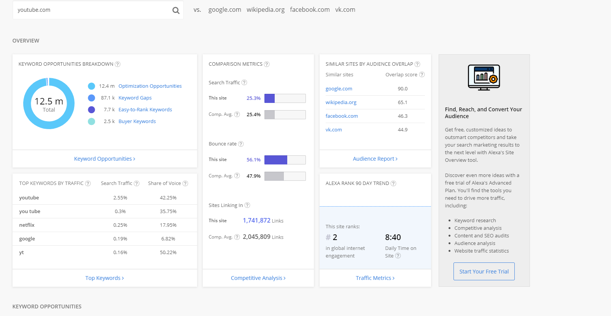
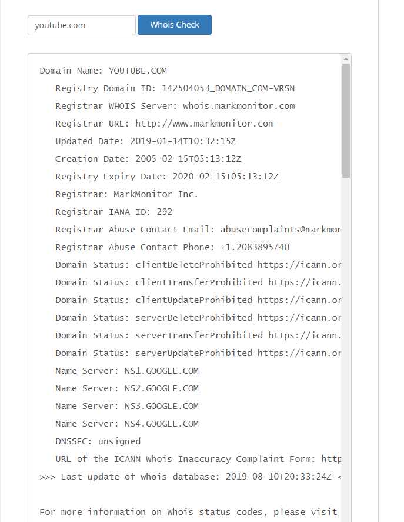
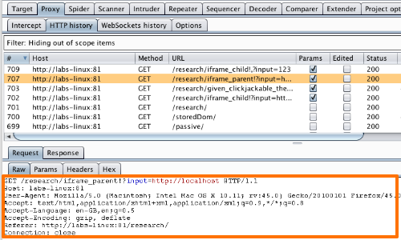

# Week 7 Web Security

## Ideas

This week we guest speaker Cedric Cochin give us a talk about the inner workings of web security. Cedric is a former white-hat hacker, penetration tester and currently work at Mcafee as a vulnerability automation engineer. Given the massive field that is web-security there was a lot that was covered, but it can mainly be broken down into two categories, User level attacks and Browser level attacks.

### User Level Attacks:
User level attacks are attacks that focus not on network vulnerabilities, not on software vulnerabilities, but instead focus on the end users themselves as a means of exploitation. User level attacks use users laziness, impatience and clickability against them to launch a variety of attacks that usually all end up as a horrible experience for the user. Below is a very short list of the possible attacks a user could expect during their time on the web. 

**Phishing**- Phishing attacks, much like normal fishing, use bait to lure in potential targets, then trap them in a unfavorable scenario. Phishing uses websites and links that look like the real-deal but instead scrape user information or provide malicious downloads. 

**SEO Poisoning**- SEO poisoning is heavily focused around Google Trends and aims to serve up malicious content for the newest trends on the web. Google is likely the safest place to browse but the occasional poisoning can still turn up.
**Social Media**- Social media profiles can be incredibly dangerous due to the fact that you can't really know who you're talking to unless you've met them in person. And if you do end up adding random people from the internet, they could potentially be skimming data from your profile. Data like: 
- projects you're working on at work
- co-workers 
- whiteboards
- your schedule
- your interests 
- important dates to you

**Fake AV**- Fake AV or fake anti-virus are programs that mimic real  AV programs but either perform malicious activities or exploit their users by producing fake infection results leading users to paying for no real service.

**Malvertising**- Malvertising as complex as it is, can be boiled down into a simple concept. Find a target -> tailor ads to fit that target -> serve those ads on their favorite sites -> perform malicous activity on the redirection. 

### Defenses
Users are most commonly referred to as the weakest link in any security set-up, so as a result your system is only as secure as your actions. There have been improvements to the user side of security but the human firewall is far from perfect and will likely always be a step behind the bad guys. 

### Browser Level Attacks:
Browser level attacks focus on either vulnerable application code or browser vulnerabilities themselves. But unlike user level attacks, we can technically solve all of these attacks with careful considerations when updating browsers and deploying new application code. 

**MitM**- MitM or man in the middle attacks are attacks that intercept internet traffic and do one or more of these three activities:
scrape : an attacker takes all of the information out of a message and uses it for other purposes. Ex: MitM scrapes your user name and password from a login.
re-route : an attacker sends your information to a completely different host, possibly resulting in you recieving a connection with a host you did not want to have.
alter : an attacker alters the information you have send to your destination host, as a result instead of buying one pizza you just bought 30000.
 
**MiB**- Very similar to MitM attacks, man in the browser does all of the activities mentioned above, but the "interception" takes place inside of your browser and not on another machine.

**DNS Hijacking/Poisoning**: DNS cache poisoning is very similar to ARP caching, which we discussed last week. The premise behind DNS cache poisoning is to have a DNS query resolve to an entirely different site than what it regualrly resolves to. This give the attackers a chance to either get some important data, or infect the target with a download.

**SQL injection**: SQL injections are the result of lack of sanitization in application code. So if a client is trying to filter down a list of items returned by the server, instead of parsing and sanitizing their input, you just directly run their string as a query and you get what's called a SQL injection. This allows an attacker to freely query your database, depending on how your access-control is setup.

### Tools for Browser Defense
## Alexa

Alexa is a free and open tool to use that determines a provided domains credibility, popularity and a ton of other details to help you make informed decisions on the urls safety. Below is the results returned for youtube.com.

## IPVoid
In a similar fasion to Alexa, IPVoid returns IP results based off of domain and couter checks them against IP blacklists from aroundthe world. Below is the results from youtube.com.

## PhantomJS
PhantomJS is a tool used by application developers and Integration testers to run a browser in a headless state(nothing is actually rendered but everything is executed). This tool is slowly being replaced by headless chrome and other native tools, but still useful nontheless.

## Burp-Suite
Burpsuite provides a host of useful tooling for diagnosing a websites security. From capturing traffic to spidering a website, burp-suite is in almost every Web-Security specialists toolbelt. 

## Fun Facts Learned
- Browser based  exploits and malware do not need to be web-centric, using the browser is just a means to an end.
- Malware authors are starting to target developers more often due to their increased exposure to end-users.
- At the time of making our lectures, Jimmy Kimmels searches were the most dangerous (result wise).
