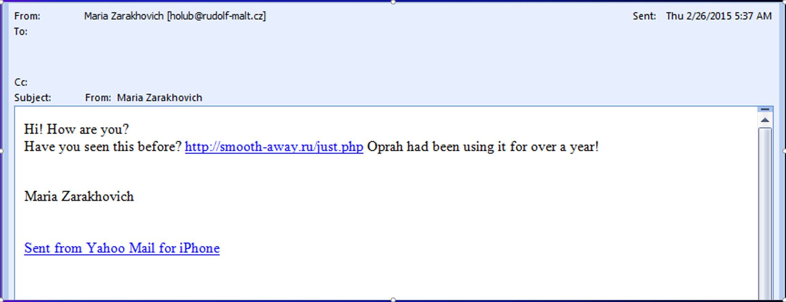
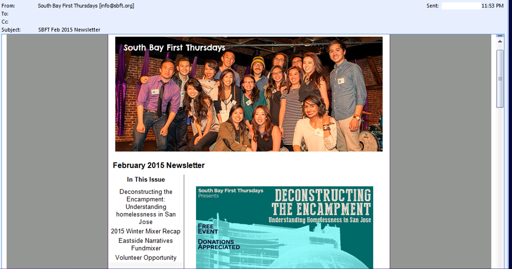
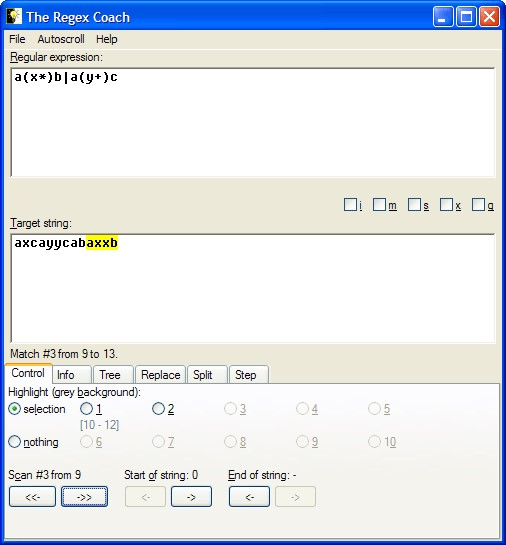

# Week 8 Messaging Security

## Ideas

This week covered the topic of messaging security and the common ways of identifying phishing, spam and ham messages. We had another guest speaker from Intel/Mcafee, Eric Peterson, who specializes in Email security and filtering. This week was a lot more hands on than previous weeks, and proved to be a culmination of all the skills and ideas from weeks prior.

### Basic Concepts:

Classification of e-mail is a difficult task. The difficulty comes from the sheer amount of e-mails that are sent everyday and the similarities between spam and regular e-mail. It'd be nice if we could just decide to block anything that even has a whiff of spam to it, but end users wouldn't like their important work e-mail being junked because we thought it was spam and vis-versa. And even if your algorithm accurately identifies 99% of all e-mail, you're still incorrectly identifying 2.7 billion messages out of the global daily 270 billion est*. 

**Spam/Ham**- Spam and Ham are the yin & yang of internet e-mail, the first can be simply identified as unwanted mail and the latter as "valid" e-mail.

**Spam-Trap**- A spam trap is either a clean(never used) domain or an old unused domain that is laid out in a publically crawlable site and waits for spam mail to be sent to it.ISP's often use users old mailboxes (after a bounce-back period) as spam-traps to update their blacklists.

**BotNet**- A botnet is a network of computers that can be orchestrated to perform actions without the computers owner having any knowledge of it. A botnet is usually formed through malware that infects a device and lies dormant until activated(much like a sleeper agent in pop-culture).

**SnowShoe-Spam**- SnowShoe spam is a technique of spamming where either a botnet or a malicious network of computers will share a load of spamming, instead of sending massive amounts from just one IP. This technique is similar to passice-recon from week 6, where the bad-actor keeps network traffic to a minimum to avoid detection.

**Phishing**- Phishing spam , much like normal fishing, use bait to lure in potential targets, then trap them in a unfavorable scenario. Phishing-spam uses emails that look like they're from valid websites and links that look like the real-deal but instead scrape user information or provide malicious downloads. 

**Spear-Phishing**- Spear-phishing simply put is a more targeted version of phishing using a targets name, job title, address or any other PII that might make the e-mail more credible.

**RBL**- Probably one of the more interesting terms from this whole term, a real-time blackhole list works much like a network firewall does for a home-network. And like blacklists for network security, RBLs are curated by trusted companies/entities acrossed the globe.

**Heuristics**- Heuristics have been discussed before and generally are the exact same for e-mails with the main key difference being that messaging security firms use Regex to match patterns instead of Yara Signatures.

**Bayesian**- Bayesian analysis of an e-mail consists of breaking every part of the e-mail down into a token, then prevalance matching those tokens against a database of known spam. An example token would be the subject of an e-mail.  

**Hashing**- Similarly to identifying a piece of malware using an md5 hash, a messaging security firm might hash the entire content or the attachments of an e-mail to try match it against a databsase. 

### Defenses
It's important to carefully check your e-mail for any phishy signs from strange country of origin, formatting, information provided, quality, length etc. Below is an autopsy of a Spam and Ham e-mail from our lecture.

#### Spam

- to: line is empty
- two urls
- sent from mobile
- very short in length 
- html based
- no periods
- russian domain
- .php destination
#### Ham 

### Tools
## Regex Coach

Alexa is a free and open tool to use that determines a provided domains credibility, popularity and a ton of other details to help you make informed decisions on the urls safety. Below is the results returned for youtube.com.

## IPVoid
In a similar fasion to Alexa, IPVoid returns IP results based off of domain and couter checks them against IP blacklists from aroundthe world. Below is the results from youtube.com.

## PhantomJS
PhantomJS is a tool used by application developers and Integration testers to run a browser in a headless state(nothing is actually rendered but everything is executed). This tool is slowly being replaced by headless chrome and other native tools, but still useful nontheless.

## Burp-Suite
Burpsuite provides a host of useful tooling for diagnosing a websites security. From capturing traffic to spidering a website, burp-suite is in almost every Web-Security specialists toolbelt. 

## Fun Facts Learned
- Browser based  exploits and malware do not need to be web-centric, using the browser is just a means to an end.
- Malware authors are starting to target developers more often due to their increased exposure to end-users.
- At the time of making our lectures, Jimmy Kimmels searches were the most dangerous (result wise).
